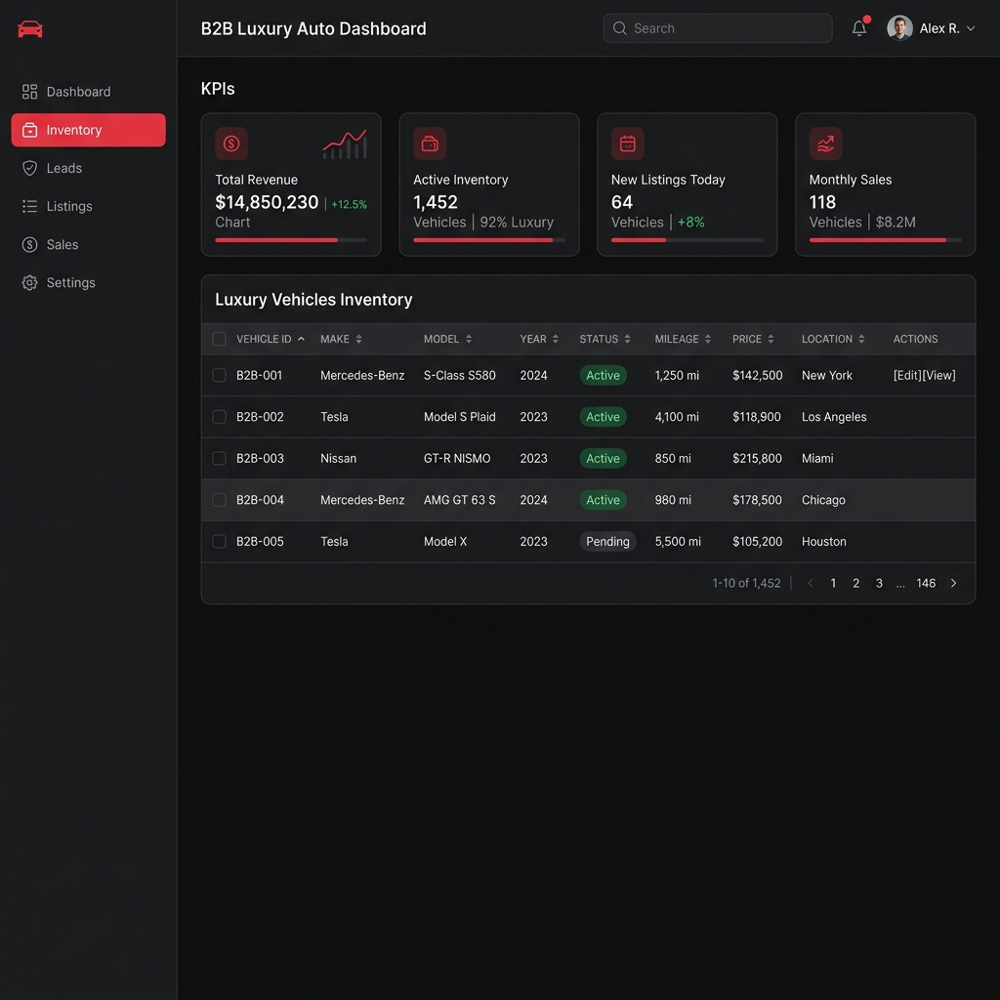

# Revora: Premium Luxury Car Marketplace



*A full-stack, enterprise-grade B2B marketplace platform for high-end vehicle inventory and checkout.*

---

## 🚀 Features

- **Dynamic Inventory Management**: Admin Dashboard with complete CRUD (Create, Read, Update, Delete) capability for fleet listings.
- **Client-Facing Storefront**: Modern UI featuring pagination, filters, and dynamic search for high net worth clients.
- **Advanced Architecture (v2)**: Progressive migration available from standard Express/React stack to a robust NestJS + Next.js architecture.
- **Secure Authentication**: JWT-based session security for administrative operations.
- **Micro-animations & Fluid UI**: High-end aesthetic using Tailwind CSS and modern React components.

## 🛠 Tech Stack

**Frontend:**
- React (Vite)
- Tailwind CSS
- Axios
- React Router DOM

**Backend:**
- Node.js & Express.js
- MongoDB & Mongoose
- JSON Web Tokens (JWT)
- bcryptjs (Password Hashing)

---

## 💻 Running Locally

To test this project locally, ensure you have **Node.js** and **MongoDB** installed and running on your machine.

### 1. Clone the repository
```bash
git clone https://github.com/yourusername/revora-project.git
cd revora-project
```

### 2. Environment Variables
Navigate to the `backend/` folder and create a `.env` file from the template:
```bash
cp backend/.env.example backend/.env
```
*(Update `.env` with your actual MongoDB URI and a secure random string for the `JWT_SECRET`)*

### 3. Install Dependencies
This project uses a root `package.json` to launch both frontend and backend instantly.
```bash
npm install
npm install --prefix frontend
npm install --prefix backend
```

### 4. Start the Application
```bash
npm run dev
```
- The **Frontend** will start on `http://localhost:5173`
- The **Backend API** will start on `http://localhost:5000`

---

## 🔐 Architecture Overview

The system utilizes an N-tier architecture. 
- **Routes Layer**: Handles API pathing and HTTP method matching.
- **Controller Layer**: Processes incoming requests and formulates standard JSON envelopes (`{ success, data, message }`).
- **Data Layer (MongoDB)**: Ensures bounded queries, connection pooling, and proper indexing on `{ brand: 1, price: -1 }` to prevent database lockups.

> **Note**: For the advanced NestJS Implementation, navigate to the `/v2/` directory in the repository.

---
© 2026 Revora Systems.
